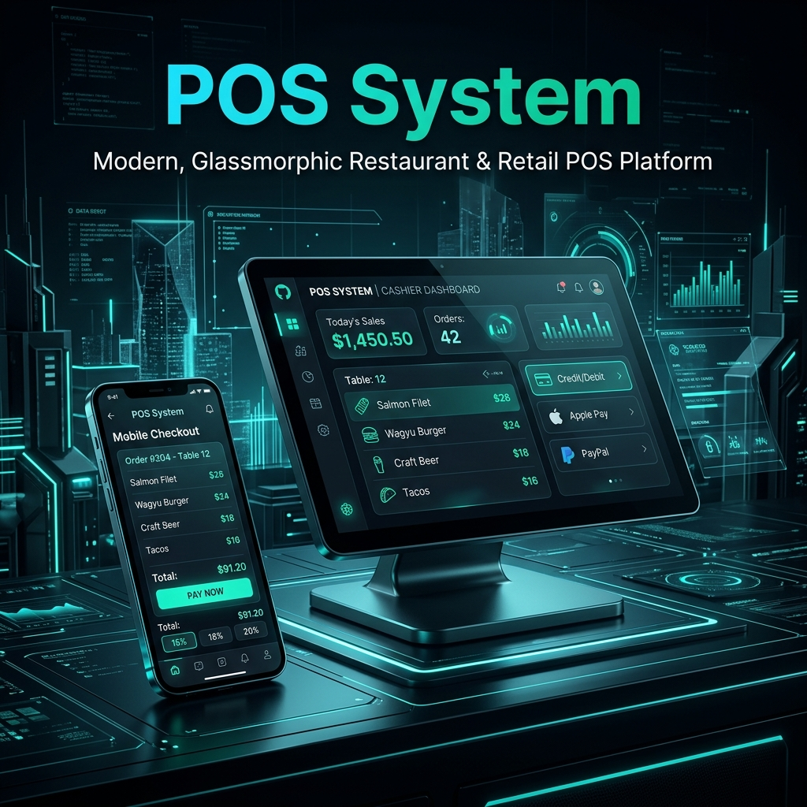
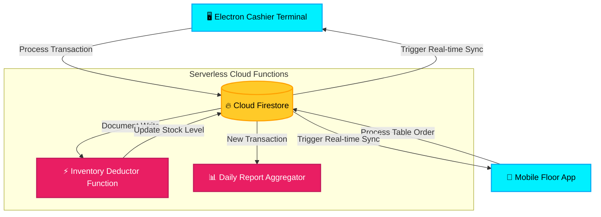

# 💳 Desktop & Mobile Point of Sale (POS) Ecosystem

[](https://react.dev)
[](https://www.electronjs.org)
[](https://vite.dev)
[](https://firebase.google.com)
[](https://opensource.org/licenses/MIT)

An enterprise-grade, high-performance Point of Sale (POS) ecosystem. This system features a powerful **Electron Desktop Application** for cashier-based terminal operations, a **Mobile Companion Checkout App** for floor staff, and serverless **Firebase Cloud Functions** backing all billing, transaction histories, and real-time inventory management.



---

## 🌟 System Architecture

The POS ecosystem integrates three core software pillars to serve complex restaurant/retail environments:

### 🖥️ 1. Electron Cashier Terminal
*A heavy-duty desktop interface built for physical cashiers, supporting ultra-low latency inputs and reliable offline capability.*
- **Native OS Wrappers:** Built with Electron, packaging a highly responsive React client into a standalone desktop application.
- **Hardware Integration:** Configured to interface with local USB thermal receipt printers, automatic cash drawers, and barcode scanners.
- **Instant Product Search:** Fast local indexing allowing cashiers to filter through thousands of items in real-time.

### 📱 2. Mobile Floor Companion App
*A lightweight web/mobile portal for waitstaff and floor managers to take orders, check table statuses, and verify stock levels.*
- **Responsive Layouts:** Mobile-optimized checkout cart and category browsers.
- **Table Mapping:** Dynamic seating grid tracking active and pending customer tables.

### ⚡ 3. Firebase Serverless Backend
*A secure cloud backend syncing inventory and financial summaries across all active terminals.*
- **Inventory Trigger Listeners:** Real-time stock counts decrease automatically as checkout transactions finish.
- **Cloud Functions:** Serverless triggers managing secure financial operations, transaction logging, and daily batch summaries.

---

## 🏗️ Architecture & Data Flow



---

## 📂 Project Structure

```text
POS System/ (Monorepo Root)
├── assets/                     # Branding banner & visual assets
├── electron/                   # Electron main & preload scripts (native desktop hooks)
├── mobile/                     # Web/Mobile companion layouts
├── functions/                  # Firebase Serverless Cloud Functions (Node.js)
├── src/                        # Core Cashier React Frontend
│   ├── components/             # Cashier cart, product lists, checkout modals
│   ├── services/               # Firestore wrappers & local search caching
│   ├── App.jsx                 # Dynamic client views & routing
│   └── index.css               # Premium CSS glassmorphic variables
├── package.json
└── vite.config.js              # Vite packaging & Electron output configurations
```

---

## ⚡ Getting Started

### Prerequisites
- [Node.js](https://nodejs.org/) (v18+)
- A [Firebase Project](https://console.firebase.google.com/) with **Cloud Firestore** and **Cloud Functions** enabled.

### 🖥️ Desktop Terminal Setup

1. **Clone & Navigate:**
   ```bash
   cd "POS System"
   ```

2. **Install Dependencies:**
   ```bash
   npm install
   ```

3. **Configure Environment Variables:**
   Create a `.env` file at the root level:
   ```env
   VITE_FIREBASE_API_KEY=your_api_key
   VITE_FIREBASE_AUTH_DOMAIN=your_auth_domain
   VITE_FIREBASE_PROJECT_ID=your_project_id
   ```

4. **Launch Electron Desktop App (Development Mode):**
   ```bash
   npm run dev
   ```
   *This starts the Vite build server and launches Electron inside a native desktop window.*

5. **Package for Production:**
   To bundle the app into a standalone desktop application (`.exe` or `.app`):
   ```bash
   npm run build
   ```
   *Outputs are generated under the `dist_electron/` directory.*

---

## 🛡️ License

This project is licensed under the MIT License - see the [LICENSE](LICENSE) file for details.
